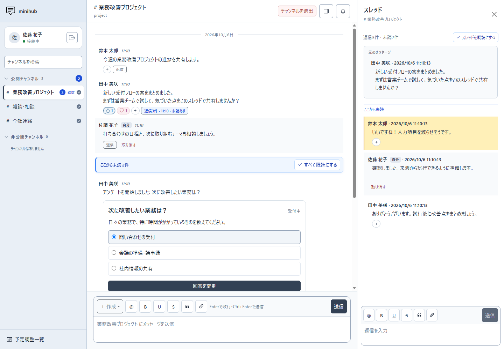
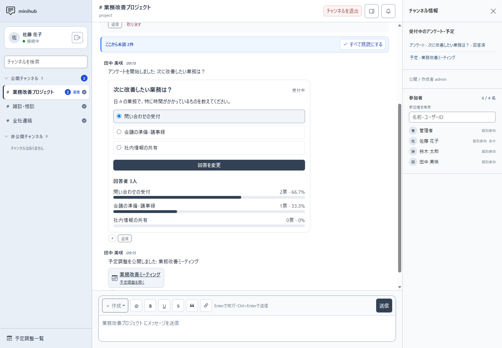
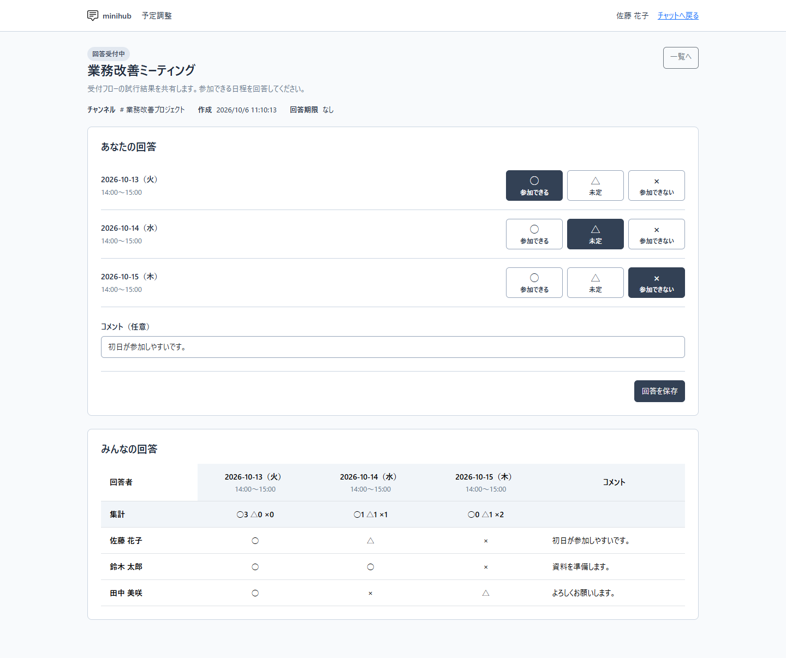

# MiniHub

`MiniHub` は、500ユーザー程度のユーザーを想定したチャットアプリケーションです。（閉域環境での利用を推奨）

単一の Go サービスとして動作し、外部DBサーバーを使わず、JSON／JSONLまたは組み込みSQLiteへデータを保存します。

[](docs/images/chat.png)

チャンネルで情報を共有し、話題ごとのスレッドで相談できます。リアクションで了解・完了・確認中・感謝を伝えられます。

掲載画像は架空のデータを使用した表示例です。画像をクリックすると原寸を確認できます。

## 画面紹介

### アンケート

チャンネル内で回答でき、選択肢ごとの票数と割合を確認できます。回答者の名前は公開されません。

[](docs/images/poll.png)

### 予定調整

候補日時に○・△・×で回答し、参加者の回答と集計を一覧で確認できます。

[](docs/images/schedule.png)

## 主な機能

- 公開・非公開チャンネルとグループによる参加者管理、チャンネル名・IDの検索
- テキスト投稿、スレッド返信、4種類のリアクション
- メンション、既読・未読、アプリ内通知と任意のOS通知
- 匿名アンケートの作成・回答・集計
- ○・△・×で回答する予定調整
- 管理者によるユーザー・チャンネル管理
- 投稿の取り消し・復元、チャンネルのアーカイブ・復元
- JSON／JSONLまたは組み込みSQLiteでの保存と、停止中のバックアップ・保存期間による削除

## 起動する（Windows／macOS／Linux）

### ビルド済み版を使う

[GitHub Releases](https://github.com/masapico/minihub/releases)にビルド済み版を公開します。サーバー機に合わせて、Windows x64（`windows_amd64.zip`）、Mac Apple Silicon（`darwin_arm64.tar.gz`）、Linux x64（`linux_amd64.tar.gz`）、Linux arm64（`linux_arm64.tar.gz`）を選んで展開してください。

展開したフォルダーには実行ファイル、サンプル設定、導入手順、HTMLマニュアルが入っています。ビルド済み版の実行にはGoは不要です。展開先のREADME、または以下の設定・起動手順に従って起動します。ビルド済み版では「ビルドして起動する」の`go build`を省略できます。

### ソースからビルドする

ソースからビルドするにはGo 1.27以降が必要です。以下のコマンドはリポジトリのルートで実行します。Windowsの例はPowerShellを使用します。

### 設定ファイルを準備する

Windows：

```powershell
Copy-Item minihub.sample.json minihub.json
```

macOS／Linux：

```bash
cp minihub.sample.json minihub.json
chmod 600 minihub.json
```

どのOSでも、`minihub.json`の`initialAdmin.password`を8文字以上・UTF-8で72バイト以下の値に変更してから起動します。実設定はGit管理せず、管理者と実行アカウントだけが読み取れる権限にしてください。Windowsではファイルの「プロパティ」→「セキュリティ」でアクセス権を設定します。

### ビルドして起動する

Windows：

```powershell
go build -o minihub.exe ./cmd/minihub
./minihub.exe -config minihub.json
```

macOS／Linux：

```bash
go build -o minihub ./cmd/minihub
./minihub -config minihub.json
```

ビルド後の起動にはGoは不要です。次回以降は、各OSの起動コマンドだけを実行します。起動したターミナルはサーバーが動作している間、開いたままにします。

### ログイン・他のパソコンからの接続

サーバー機のブラウザで <http://127.0.0.1:8080/login> を開き、管理者ID `admin` と設定したパスワードでログインします。初回管理者の作成後は設定ファイルから`initialAdmin`を削除してください。

閉域内の他のパソコンからアクセスさせる場合は、`0.0.0.0:8080`で起動します。`0.0.0.0`はサーバー機のすべてのIPv4ネットワークインターフェースで待ち受ける指定です。起動中の場合は一度停止してから、次のコマンドで起動してください。

Windows（PowerShell）：

```powershell
./minihub.exe -config minihub.json -addr 0.0.0.0:8080
```

macOS／Linux：

```bash
./minihub -config minihub.json -addr 0.0.0.0:8080
```

毎回`-addr`を指定せずに使う場合は、`minihub.json`の`server.listenAddress`を`"0.0.0.0:8080"`へ変更し、通常の起動コマンドで起動します。`-addr`を指定すると、設定ファイルの待受アドレスより優先されます。

サーバー機のファイアウォールでは、必要な閉域内の接続元からTCP 8080へのアクセスを許可します。他のパソコンでは、サーバー機のIPアドレスが`192.168.1.10`の場合、ブラウザで <http://192.168.1.10:8080/login> を開きます。サーバー機のホスト名でも接続できます。HTTP／HTTPSの設定例は[管理者マニュアル](docs/admin-manual.md#httphttpsの選択)を参照してください。

既存Webサーバーの `https://myhost.com/hub/` などで公開する場合は、`server.basePath` を `"/hub"` に設定します。nginxではパスを保持して転送し、WebSocketの転送ヘッダーも設定します。設定例は[管理者マニュアルのリバースプロキシとベースパス](docs/admin-manual.md#リバースプロキシとベースパス)を参照してください。

利用者側はWindows・macOS・Linuxいずれもブラウザから接続できます。利用者のパソコンにGoやサーバーの実行ファイルを入れる必要はありません。設定変更後はサーバーを再起動します。

### 停止・バックアップ

上記の方法で起動した場合は、どのOSでも起動したターミナルでCtrl+Cを押し、プロセスの終了を待ちます。Windowsでは、同じ実行アカウントの別のPowerShellから停止することもできます。

```powershell
./minihub.exe stop -config minihub.json -wait 60s
```

バックアップは停止後に、`server.dataDir`が指すデータディレクトリ全体をコピーします。Windowsでは[scripts/backup.bat](scripts/backup.bat)で停止とZIPバックアップを実行できます。スクリプト内のパス設定などは[管理者マニュアルのWindowsバックアップ手順](docs/admin-manual.md#windowsのバックアップ)を参照してください。

設定・運用・復元の詳細は[管理者マニュアル](docs/admin-manual.md)を参照してください。

## 資料

| 目的 | 資料 |
| --- | --- |
| 導入・設定・バックアップ | [管理者マニュアル](docs/admin-manual.md)（[HTML版](docs_html/admin-manual.html)） |
| チャットの使い方 | [ユーザーマニュアル](docs/user-manual.md)（[HTML版](docs_html/user-manual.html)） |
| 保存方式の選択・移行 | [SQLite移行手順](docs/sqlite.md)（[HTML版](docs_html/sqlite.html)） |
| APIを使う | [APIリファレンス](docs/api.md) |
| 設計・開発・通信負荷 | [開発・保守資料一覧](docs/README.md) ／ [設計仕様](DESIGN.md) |
| リリースビルド・手動公開 | [リリース手順](docs/releases.md) |
| 検証・画面画像の更新 | [検証手順](tests/README.md) |

操作資料の[HTML版一覧](docs_html/index.html)も利用できます。`docs_html`フォルダーを丸ごとコピーし、`index.html`をブラウザで開いて閲覧できます。
