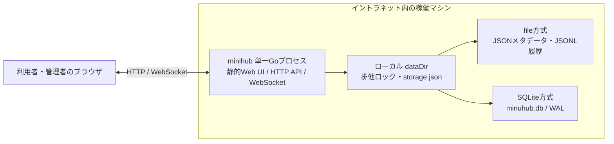
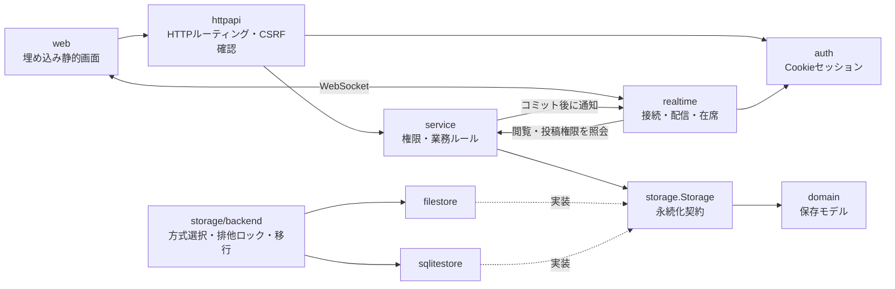
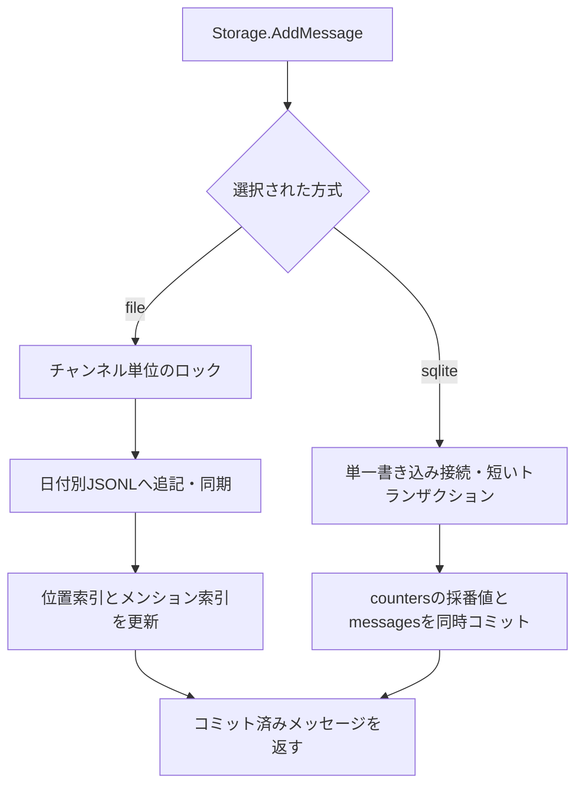

# アーキテクチャ

[設計図の目次](README.md) / [データモデル](data-model.md) / [処理フロー](workflows.md)

## 配置

`storage.type` で **file または sqlite の片方**を選びます。上図の2方式は同時に使う構成を意味しません。SQLite はローカルディスク上で使い、外部DBサーバーはありません。両方式ともデータディレクトリのプロセス排他ロックを取得し、`storage.json` と設定の方式が食い違う場合は起動を拒否します。

## コンポーネントと責務

`cmd/minihub` が設定を読み、ストレージ・初期管理者・サービス・HTTP・WebSocket を組み立てます。HTTP更新要求はセッション認証とCSRF確認を経て、サービス層で権限を判定します。非公開チャンネルの閲覧・投稿可否はサーバー側で判定し、WebSocket配信時にも閲覧権限を確認します。

保存処理が成功した後に、WebSocketはチャンネルIDや連番などの軽量イベントを配信します。クライアントは必要な本文や集計をHTTP APIから取得します。通常終了ではHTTP受付を止め、WebSocket接続を閉じてからストレージを閉じます。

## ストレージの書き込みと復旧

file方式はメッセージ本文をメモリへ全件ロードせず、必要な位置索引を再構築します。JSONLの不完全な末尾行は復旧時に無視・切り詰めます。SQLite方式は永続索引を使い、採番値を `counters` に保持します。SQLite破損時にfile方式へ自動で切り替える動作はありません。

## フロントエンド依存

Web画面、Bootstrap、Bootstrap Icons、faviconはGoの実行ファイルへ埋め込まれています。ビルド後の別途配置やCDN接続は不要です。

- Bootstrap 5.3.8
- Bootstrap Icons 1.13.1

配布用のCSS、JavaScript、SVG spriteとライセンスを `web/vendor/` に同梱しています。実行時にnpmやインターネット接続は使用しません。
