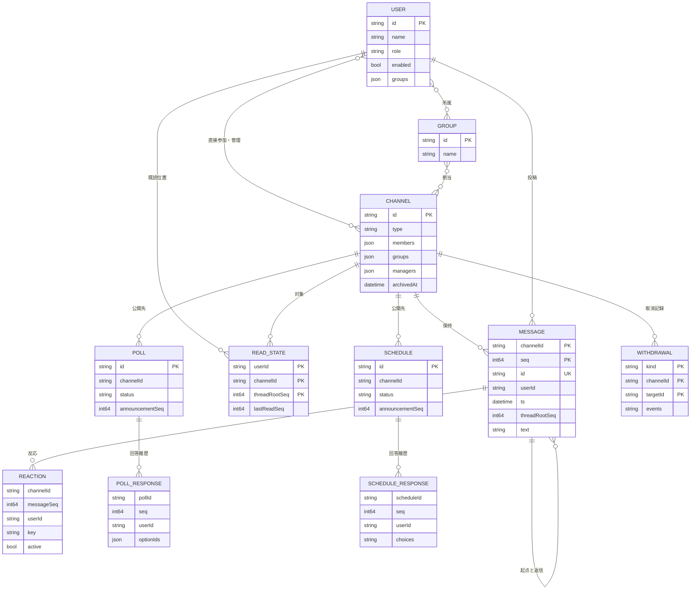
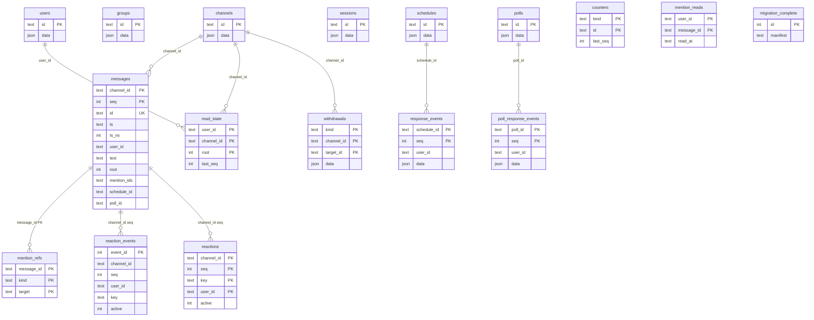
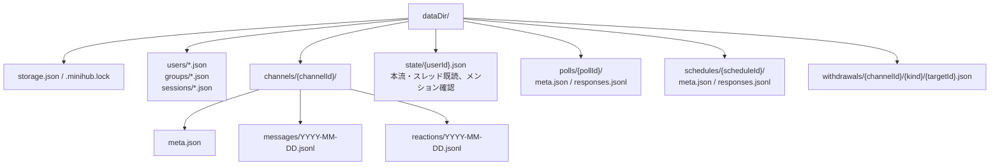

# データモデル

[設計図の目次](README.md) / [アーキテクチャ](architecture.md) / [処理フロー](workflows.md)

## 論理ER図

これは**概念上の関係**です。`User.Groups` がグループ所属の正本で、チャンネルの直接参加者・割当グループ・管理者は `Channel` の配列にあります。独立した所属レコードを両方式で保存するわけではありません。グループ所属者とチャンネル割当グループから実効メンバーを判定します。公開チャンネルの閲覧は非参加者にも許可されますが、投稿は参加が必要です。非公開チャンネルは実効メンバーのみ閲覧・投稿できます。

メッセージの `seq` はチャンネル内で単調増加し、返信も同じ連番を使います。`threadRootSeq=0` は本流、正の値は起点メッセージの連番です。既読位置はユーザー×チャンネルと、閲覧したスレッドごとに保持し、後戻りさせません。`POLL` と `SCHEDULE` は告知メッセージへの参照を持ちます。`WITHDRAWAL` はメッセージ・投票・予定調整の取消と復元の履歴で、元データの物理削除ではありません。

## SQLiteの物理ER図

図の線は参照関係を示します。DB制約として宣言された外部キーは `mention_refs.message_id → messages.id` です。その他の参照はサービス層とストレージ処理で検証し、SQLの外部キー制約を示すものではありません。`users`・`groups`・`channels`・`sessions`・`schedules`・`polls` はバージョン付きJSONを1件ずつ保持します。`user_groups`、`channel_members`、`channel_groups`、`channel_managers` はそのJSONから作る**ビュー**であり、別の保存テーブルではありません。

`messages` は `(channel_id, seq)` が主キーで `id` は全体で一意です。`messages` にはスレッド・時刻・投稿者の索引があります。`counters` は採番の正本で、将来履歴を消しても連番を再利用しないための表です。`reaction_events` と回答イベント表は履歴、`reactions` はリアクションの現在状態を持ちます。SQLiteスキーマは現行の `PRAGMA user_version=3` です。

## file方式の保存構成

file方式は小さなメタデータをJSONで置換し、メッセージと回答・リアクションの履歴をJSONLへ追記します。日付別メッセージファイルは時刻による分割であり、順序は `seq` で判断します。`state/{userId}.json` はユーザー単位の高水位を保持し、メッセージ×ユーザーの全組み合わせを作りません。未完了のJSONL末尾行は索引に含めません。
