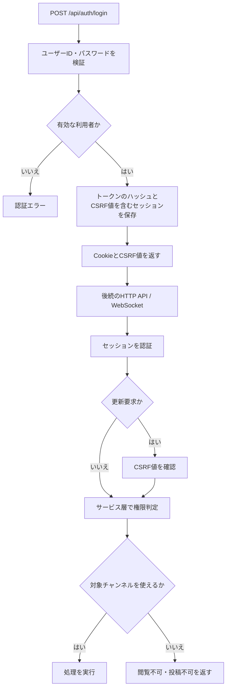
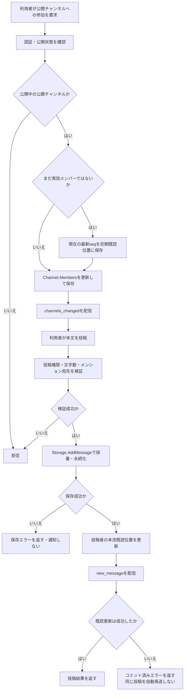
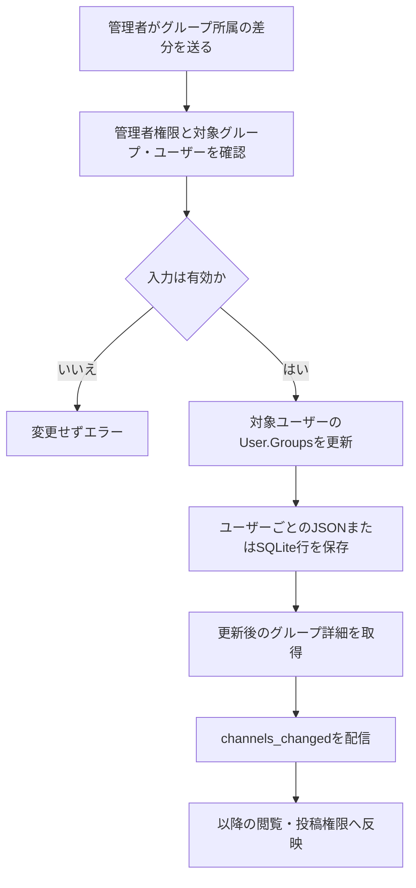
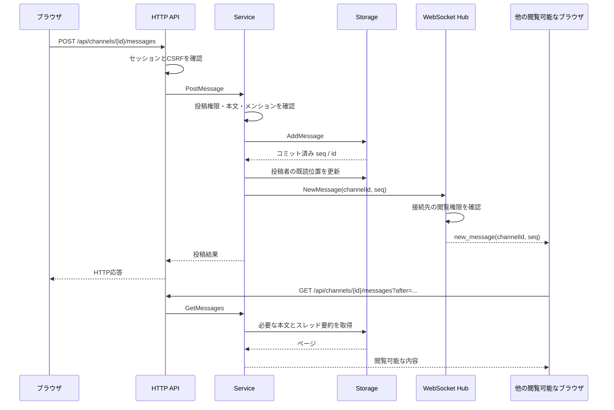
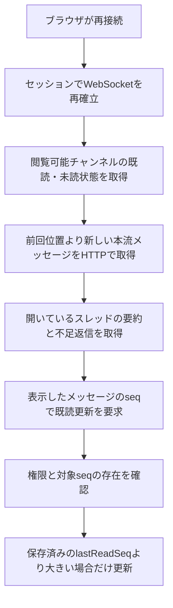
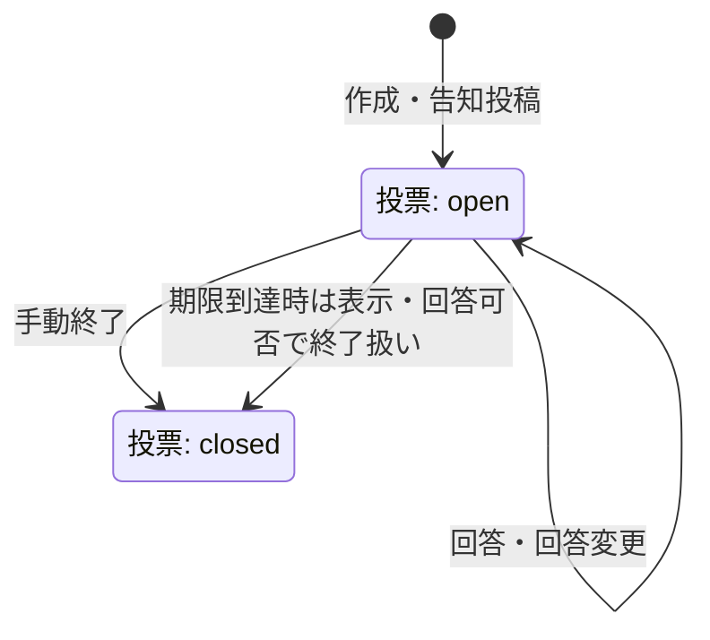
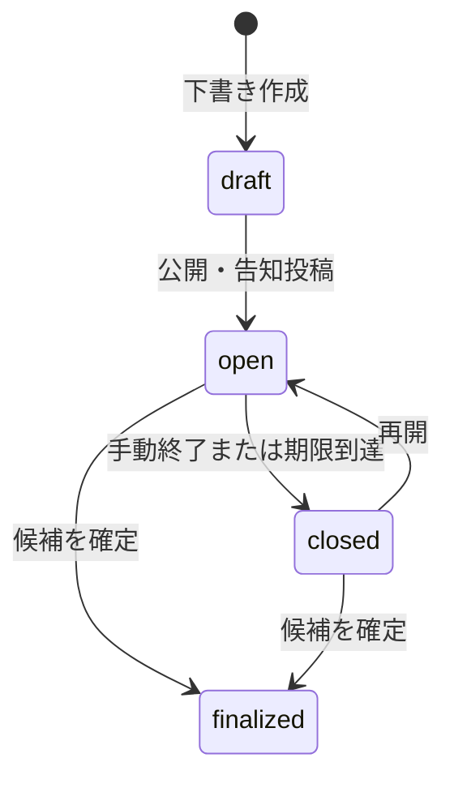
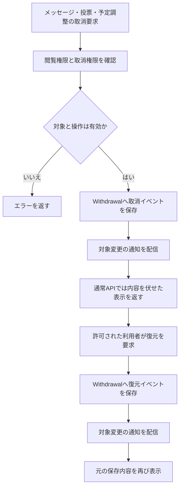
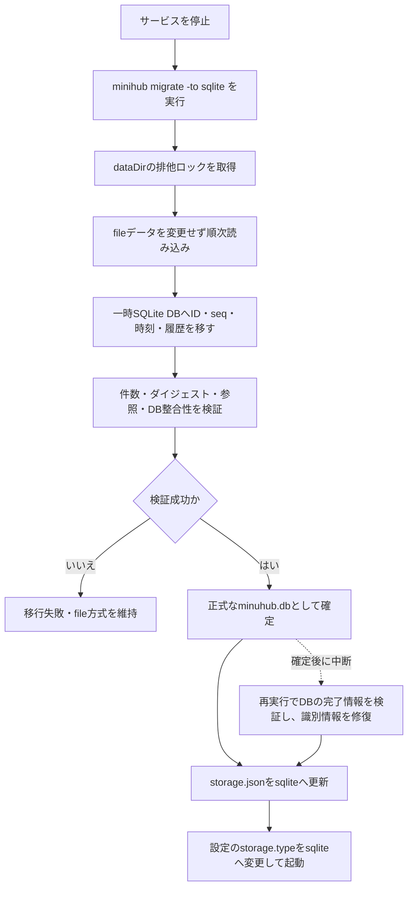

# 処理フロー

[設計図の目次](README.md) / [アーキテクチャ](architecture.md) / [データモデル](data-model.md)

以下のアクティビティ図は Mermaid のフローチャートで表しています。現行コードの主な分岐を示し、細かい入力制限や全APIを列挙するものではありません。

## ログインとチャンネル認可

公開チャンネルは非参加者も閲覧できますが、投稿には参加が必要です。非公開チャンネルの閲覧・投稿は直接参加者または割当グループの有効な所属者に限ります。アーカイブ中は通常の閲覧・投稿ができません。管理操作は管理者または対象チャンネルの管理者に絞られます。

## チャンネル参加と投稿

初参加でまだ実効メンバーでない場合は、参加時点の最新連番を既読位置に設定します。退出はチャンネル管理者には許可されません。本流投稿の `AddMessage` が成功した後、投稿者の既読更新と通知が行われます。既読更新に失敗しても投稿は取り消されず、通知は配信されます。スレッド返信は起点の存在と取消状態を確認し、同じチャンネル連番で保存した後に `thread_updated` を配信します。返信時に本流の既読位置を進める処理はありません。

## グループ所属の管理

所属の正本は `User.Groups` です。複数ユーザーへの保存はユーザー単位で進み、途中の永続化失敗時に一括ロールバックされる契約ではありません。

## 投稿から通知・取得までのシーケンス

WebSocketイベントは履歴本文を複製しません。接続していない間の投稿も、再接続時にHTTP APIで取得します。通知は保存済みデータの存在を知らせる手段で、履歴の正本ではありません。

## 既読と再接続

本流の未読数は既読位置より新しい本流投稿から計算します。スレッドは起点ごとに返信の既読位置を持ち、未読や更新の表示を別に計算します。古いクライアントからの更新で既読位置は後退しません。メンション確認時刻もユーザー状態として保存されます。

## 投票・予定調整の状態

投票回答はイベントを追記し、ユーザーの最新回答で集計します。期限到達による `closed` は表示・回答可否の判定であり、必ずしも保存済み `status` の書き換えを伴いません。回答の競合は前回回答の連番で検出します。

予定調整の回答は候補ごとの選択とコメントを履歴に追記し、最新回答を採用します。公開・確定時にはチャンネルに参照付き告知メッセージを投稿します。取消はどちらの業務データでも別の `Withdrawal` 記録で管理し、元の状態と履歴を物理削除しません。チャンネルのアーカイブもメタデータ変更です。

## 取り消し・復元

投稿本文と投票・予定の元レコードは書き換えず、取消の状態と履歴を別に持ちます。投票・予定の告知投稿はそれぞれの取消APIから扱い、通常メッセージの取消APIでは扱いません。

## 停止中の file → SQLite 移行

`-dry-run` は同じ検証を一時DBで行い、方式を切り替えません。移行元のfileデータは残ります。復旧やバックアップの詳細は [DESIGN.md](../DESIGN.md) の「SQLite保存方式」を参照してください。
